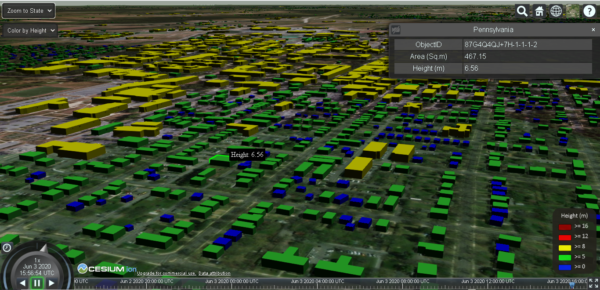

# Overview
This repo contains automated tool that is created using python, which can automatically convert large set of cityGML files to Cesium 3D Tiles. 
Second major part in this project is an IIS server which contains webpages that are capable of visualization of large amount of 3D city data.

# 3D City Visualization
* With advancements in the field of computer graphics, role of 3D Geo-Visualization has increased ever since.
* CityGML is xml based official format of OGC for 3D city and landscape models.
* However CityGML is not optimized to be visualized on Web.
* For faster rendering of 3D data on web, Cesium 3D tiles is a better option.

# Objective
* Data collection/ auto-downloading from the source i.e. GitHub repository. 
* Automation of the conversion of CityGML to 3D Tiles.
* Building a GUI for automation of tasks.
* Visualize 3D city model of the whole USA (nearly 125 million buildings) with LOD1 building models on a Web-Based platform to access and examine it effortlessly. 

# Data Used in this project
* This study is conducted for data of “The United States”. 
* Source of Data: https://github.com/opencitymodel/opencitymodel

# Prerequisites
There are certain prerequirements that needs to be fulfilled. These are as follows: 
1. **FME** 
2. **Python** 
3. **PyQT5**
3. **JavaScript**
4. **HTML**

# Methods
* Following methodology has been used to implement this project:

* Python GUI: It has two major parts Download, Conversion.

  **Download:** As stated above, the data is fetched from html webpage. This webpage contains hundreds of links to fetch open data. So this portion of software contains an option to just give the link of the webpage and folder where the data can be downloaded and saved from the wegpage.  
  **Conversion:** This portion of python software allows to convert CityGML files to Cesium 3D Tiles. It requires FME model, input CityGML file(s) and output folder location. There are additional options provided. To understand this functionality, it is important to mention here that there are total 51 states data which further contains 5026 files. So, it is practically impossible for machines to convert all of the data at once. So this additional options are provided for the convenience of the user. If the user possess a very powerful machine they can opt to convert **All** models at once, or **State-Wise**, and  in the worst case if the machine is not very powerful then **Cluster{State-wise}** option can group certain input files to process together. 
  
 # WebServer
The web server consist of two components: Webpage (based on HTML and Javascript) and Webservice (based on C#). The function of the webservice is to grab the corresponding '.json' URLs of 3D tilesets from the server and visulize them on the webpage as requested by the user. The visualization is done as one State at a time due to large amount of data. The front-end of the website is developed using JavaScript with CesiumJS Library, few functionalities are defined to make the webpage interactive.  
 
 
 
The webpage has mulitiple user interaction options:
 * Zoom to State: Select a State from the dropdown list to view its corresponding 3D model of buildings
 * Styling: Colorizing buildings with respect to their "Height" or "Area".
 * Building Details: Clicking on individual building to display further attribution associated with it.
 * Mouse Hover: To display heights of each buildings on mouse-over.

Furthermore, defualt CesiumJS features are also included, for instance, different basemaps, search tab, changing current time and day, fullscreen view, etc.

 ---
  

# Authors
* Harpreet Singh, harpreet19897079@gmail.com 
* Saad Asif Khan, saadasif_9@hotmail.com

